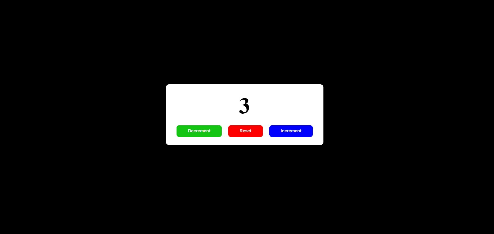
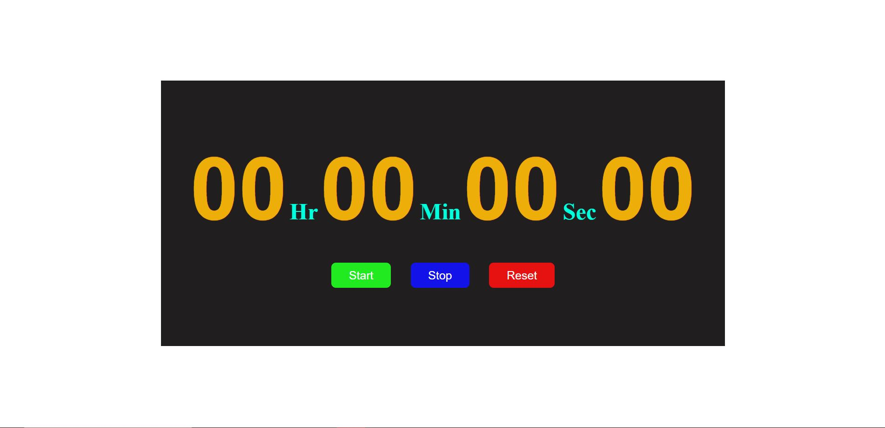
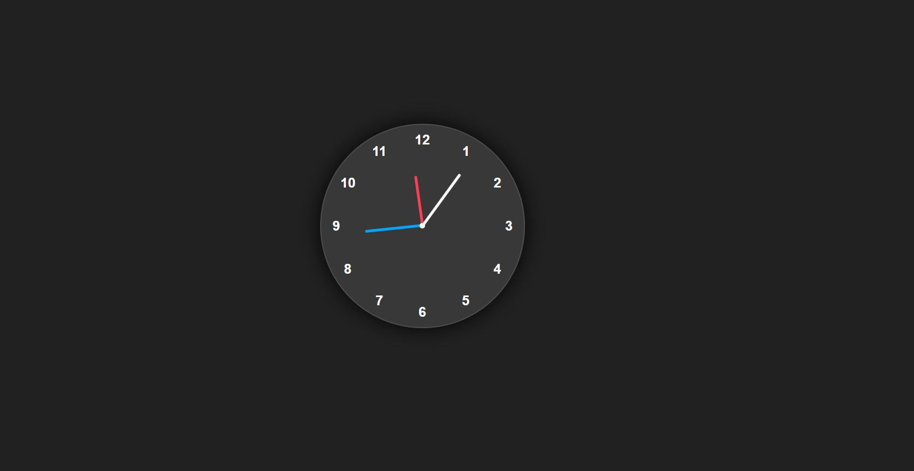
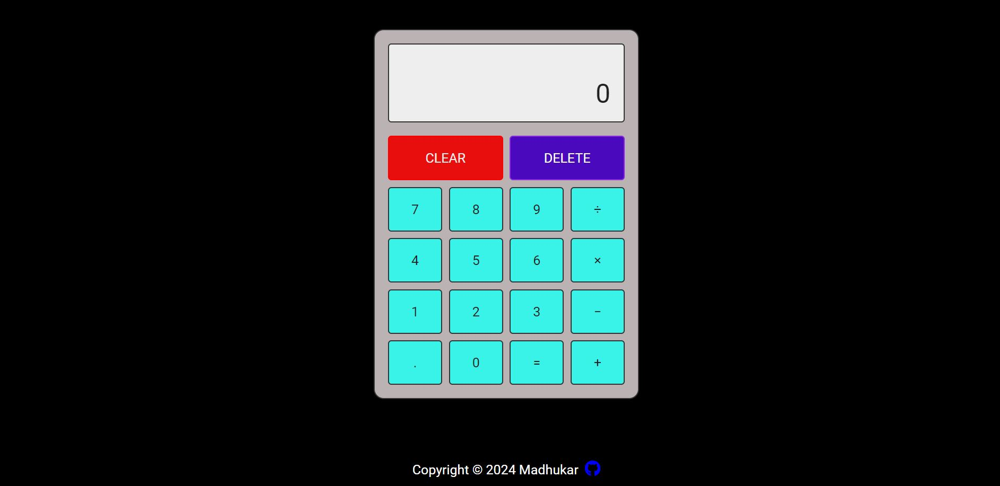

# JavaScript-Mini-Project

# Objective
The main objective of our project was to make practical use of all the coding skills that we learnt in Masai School to build the Project.

# Deployment
 The Project is deployed on netlifty - [Link]()

# Tech-Stack
HTML

CSS

Javascript

# Snapshots of Pages

# Counter App

# Stop-Watch

# Analog Clock

# Analog Clock

